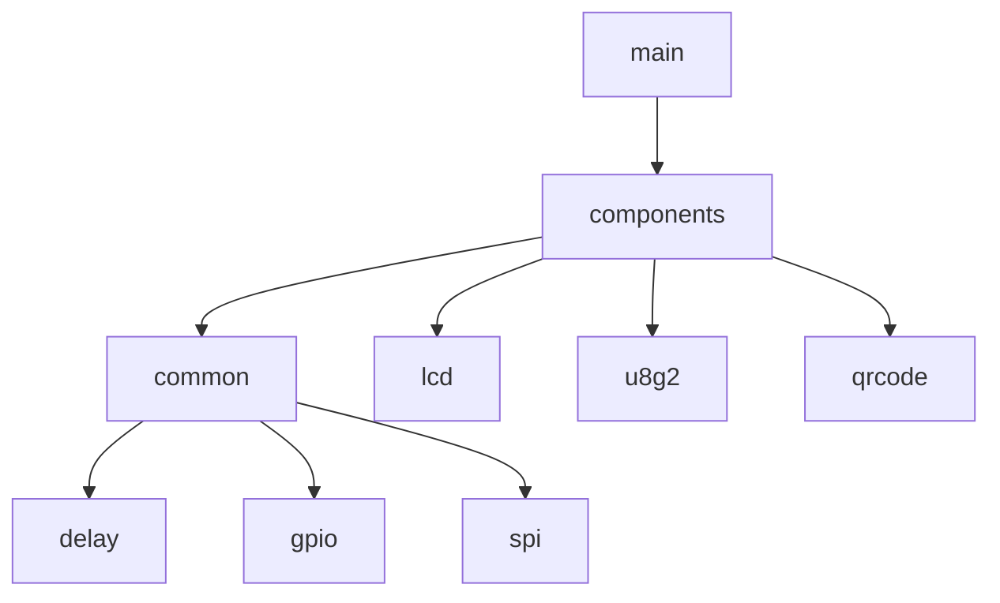

# EspLcd


### 介绍
esp32通过SPI驱动lcd显示屏，纯C开发，VSCode开发环境。


### 软件架构

- LCD驱动库主要是从如下两个开源项目移植而来
	- [梦程MI / LuatOS-ESP32](https://gitee.com/dreamcmi/LuatOS-ESP32)
	- [合宙Luat / LuatOS](https://gitee.com/openLuat/LuatOS)
- 软件框架如下
	- common是通用组件库，包含delay/gpio/spi等
	- lcd是lcd驱动库
	- qrcode是二维码生成库
	- u8g2是图形库 



### 组件库API列表


| 函数 | 参数 | 返回 | 功能 | 
|:--|:--|:--| :--|
| ```spi_init```| ```int bus_id```：SPI号<br>```int cs```：CS 片选脚<br>```int cpha```：CPHA 默认0,可选0/1<br>```int cpol```：CPOL 默认0,可选0/1<br>```int dataw```：数据宽度,默认8bit<br>```int bandrate```：波特率,默认2M=2000000<br>```int bit_dict```：大小端, 默认MSB, 可选LSB<br>```int master```：主从设置, 默认主1, 可选从机0. 通常只支持主机模式<br>```int mode```：工作模式, 全双工1, 半双工0, 默认全双工|```spi_device_t *spi_device```：spi参数|spi初始化|
|```lcd_setup```|```spi_device_t *spi_device```：spi参数<br>```char* tp```：lcd类型，有st7796/st7789/st7735/gc9a01等<br>```int pin_dc```：数据/命令选择引脚<br>```int pin_pwr```：背光引脚<br>```int pin_rst```：复位引脚<br>```int direction```：屏幕方向 0:0° 1:180° 2:270° 3:90°```int w```：水平分辨率<br>```int h```：竖直分辨率<br>```int xoffset```：x偏移<br>```int yoffset```：y偏移|```lcd_conf_t* conf```：lcd配置 |lcd初始化|
|```lcd_clear```| ```lcd_conf_t* conf```：lcd配置<br>```color_t color```：清屏颜色|int | lcd清屏|
|```lcd_inv_off```| ```lcd_conf_t* conf```：lcd配置|int | lcd关闭反色|
|```lcd_draw_point```|  ```lcd_conf_t* conf```：lcd配置<br>```uint16_t x, uint16_t y```：点的位置<br>```color_t color```：绘图的颜色|int|lcd画一个点|
|```lcd_draw_fill```| ```lcd_conf_t* conf```：lcd配置<br>```uint16_t x1,uint16_t y1```：左上点<br>```uint16_t x2,uint16_t y2```：右下点<br>```color_t color```：绘图的颜色|int |lcd颜色填充|
|```lcd_draw_line```| ```lcd_conf_t* conf```：lcd配置<br>```uint16_t x1, uint16_t y1```：第一个点<br>```uint16_t x2, uint16_t y2```：第二个点<br>```color_t color```：绘图的颜色|int |lcd画一条线|
|```lcd_draw_rectangle```| ```lcd_conf_t* conf```：lcd配置<br>```uint16_t x1, uint16_t y1```：左上点<br>```uint16_t x2, uint16_t y2```：右下点<br>```color_t color```：绘图的颜色|int |lcd画一个框|
|```lcd_draw_circle```| ```lcd_conf_t* conf```：lcd配置<br>```uint16_t x0, uint16_t y0```：圆心<br>```uint8_t r```：半径<br>```color_t color```：绘图的颜色|int |lcd画一个圆|
|```lcd_set_font```| ```lcd_conf_t* conf```：lcd配置<br>```const uint8_t *ptr```：字体指针|int |lcd设置字体|
|```lcd_draw_str```| ```lcd_conf_t* conf```：lcd配置<br>```int x, int y```：左下起始点<br>```char* str```：字符串<br>```color_t color```：绘图的颜色|int |lcd显示字符串|
|```lcd_draw_qr_code```| ```lcd_conf_t* conf```：lcd配置<br>```int x, int y```：左下起始点<br>```char* str```：二维码内容<br>```int size```：二维码大小|int |lcd显示二维码|
|```lcd_draw_xbm```| ```lcd_conf_t* conf```：lcd配置<br>```int x, int y```：左下起始点<br>```int w```：位图宽<br>```int h```：位图高<br>```char* data```：位图数据,每一位代表一个像素<br>```int data_len```：位图数据长度|int |lcd绘制位图|


**备注**
- SPI初始化时，选择SPI号，就选择了SPI的CLK和DATA引脚，ESP32-C3一般选择SPI2。
- LCD字体，在```components/lcd/u8g2/u8g2_luat_fonts.h```文件中。


### 博客

[ESP32-C3入门教程 基础篇⑥——SPI通信点亮LCD显示屏](https://blog.csdn.net/kangweijian/article/details/126408737)
